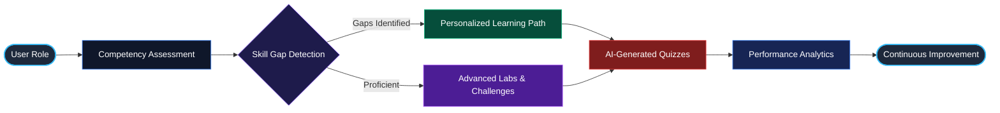
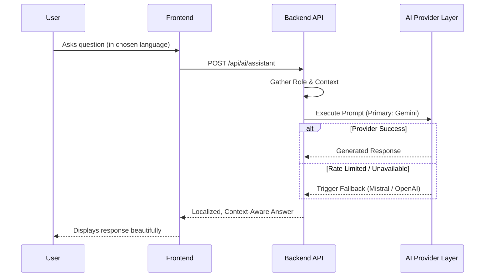
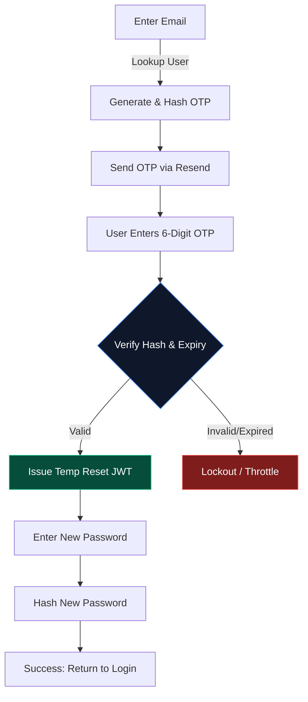
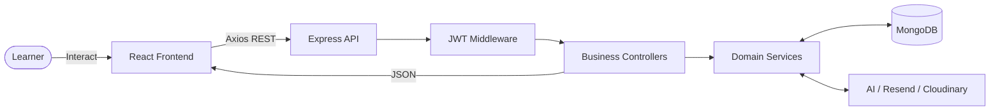
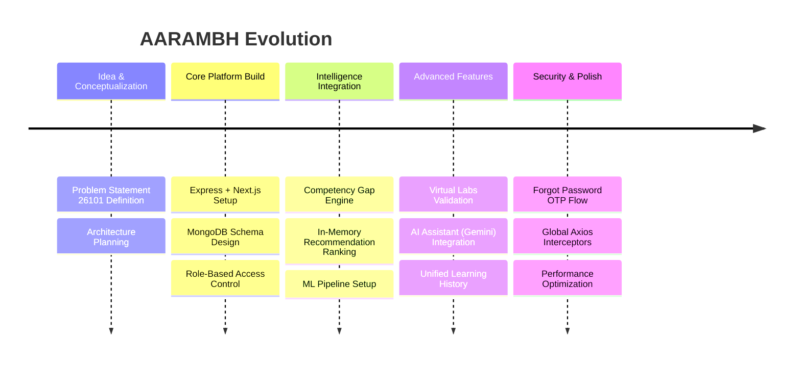

<div align="center">


# AARAMBH
**AI-Assisted Competency Intelligence & Personalized Learning**

[](#)
[](#)
[](#)
[](#)
[](#)
[](#)

*Developed for SIH 2026 — Problem Statement 26101*

</div>

<br />

> **AARAMBH** connects learner context, competency evidence, role requirements, skill gaps, learning recommendations, assessments, and AI-driven intelligence into a unified workforce capacity-building platform designed for India's Official Statistical System.

---

## 📑 Table of Contents

- [What is AARAMBH?](#-what-is-aarambh)
- [Problem Statement](#-problem-statement)
- [Our Solution](#-our-solution)
- [How AARAMBH Works](#-how-aarambh-works)
- [Key Features](#-key-features)
- [AI Assistant](#-ai-assistant)
- [Skill Gap & Personalized Learning](#-skill-gap--personalized-learning)
- [Quiz & Assessment System](#-quiz--assessment-system)
- [Performance & Analytics](#-performance--analytics)
- [Authentication & Security](#-authentication--security)
- [System Architecture](#-system-architecture)
- [Data Flow](#-data-flow)
- [Technology Stack](#-technology-stack)
- [Project Structure](#-project-structure)
- [API Documentation](#-api-documentation)
- [Environment Configuration](#-environment-configuration)
- [Installation & Running Locally](#-installation--running-locally)
- [Project Journey](#-project-journey)
- [Current Status](#-current-status)
- [Roadmap](#-roadmap)

---

## 🌍 What is AARAMBH?

**AARAMBH** is a state-of-the-art, AI-powered workforce development platform. It moves beyond traditional Learning Management Systems (LMS) by creating a dynamic, closed-loop competency engine. 

Instead of generic training lists, AARAMBH intelligently evaluates what a learner knows, what their role requires, and exactly what learning pathways will bridge that gap. With built-in AI tutoring, virtual labs, and robust analytics, it ensures capability building is transparent, measurable, and highly personalized.

---

## 🎯 Problem Statement

*(SIH 2026 – PS 26101)*

Building capacity in a large-scale workforce like India's Official Statistical System faces critical bottlenecks:
- **Invisible Skill Gaps:** Difficulty in accurately identifying what employees know versus what their roles demand.
- **Generic Training:** One-size-fits-all learning paths lead to low engagement and poor knowledge retention.
- **Disconnected Data:** Assessment results, learning history, and performance metrics are often siloed.
- **Manual Overhead:** Creating relevant quizzes, assessments, and tracking progress requires massive manual intervention.

---

## 💡 Our Solution

AARAMBH solves these bottlenecks by introducing a deterministic, AI-augmented competency engine. 

<div align="center">



</div>

---

## ⚙️ How AARAMBH Works

AARAMBH operates on a continuous feedback loop:

1. **Authentication:** Secure, role-based access ensures learners, faculty, and admins see context-appropriate data.
2. **Context & Evidence:** The system evaluates existing learning records and previous assessment scores.
3. **Gap Identification:** Comparing current proficiency against role requirements generates a precise skill gap.
4. **Personalized Recommendations:** An in-memory ranking engine and ML-pipeline generate tailored course/lecture recommendations.
5. **Learning & Assessment:** Users engage with rich content and validate their knowledge through AI-generated quizzes and virtual labs.
6. **Analytics & AI Assistance:** Performance is updated, and the AI Assistant provides contextual, multilingual tutoring on demand.

---

## ✨ Key Features

| Feature | Description |
|---------|-------------|
| 🔐 **Enterprise Security** | JWT-based auth, HttpOnly cookies, RBAC, and secure OTP-based password resets. |
| 📊 **Skill-Gap Analysis** | Deterministic gap calculation (`requiredLevel - currentLevel`) with evidence rationale. |
| 🎯 **Personalized Learning** | Tailored course recommendations using a hybrid in-memory scoring engine. |
| 🤖 **AI Assistant** | Context-aware, multilingual AI tutor backed by Gemini with resilient provider fallbacks. |
| 📝 **AI Quizzes** | Automated MCQ generation from learning materials with validation flows. |
| 🔬 **Virtual Labs** | Constrained sandbox environments for practical, hands-on capability validation. |
| 📈 **Deep Analytics** | Comprehensive organizational, department, and role-level performance tracking. |
| 🌐 **iGOT/NSSTA Support** | Architecture prepared for live/simulated catalog synchronization. |

---

## 🤖 AI Assistant

AARAMBH features a deeply integrated, role-aware AI Assistant. It does not just chat; it understands the user's role, language preference, and the specific learning context they are currently viewing.

<div align="center">



</div>

**Capabilities:**
- Multilingual responses (Hindi, English, etc.) based on user preferences.
- Secure, context-grounded fallback mechanisms.
- Prevents hallucination of government/iGOT data.

---

## 📈 Skill Gap & Personalized Learning

The heart of AARAMBH is its recommendation engine. 
- **Gap Detection:** Accurately maps an employee's 0–5 proficiency against required competencies.
- **In-Memory Scoring:** For blazing-fast responses, the catalog is scored dynamically based on keyword relevance, existing enrollments, and prior completion history.
- **Adaptive Pathways:** As learners complete assessments, the recommendation loop tightens, offering increasingly relevant material.

---

## 📝 Quiz & Assessment System

Knowledge validation is seamlessly integrated:
- **Auto-Generation:** AI parses transcripts and documents to build relevant MCQs.
- **Evaluation:** Server-side validation prevents cheating and tampering.
- **Competency Impact:** Passing formal assessments directly updates the learner’s proficiency evidence, feeding back into the Skill Gap engine.

---

## 📊 Performance & Analytics

AARAMBH features a read-only, unified analytics foundation that ensures reporting never alters underlying raw evidence:
- **Learner Level:** Snapshots of recent activity, improvements, and assessment scores.
- **Admin/Faculty Level:** Aggregate distributions of organizational competence, department-wise gaps, and platform effectiveness.
- **Evidence Lineage:** Strict tracing of exactly *why* a competency score improved (e.g., linked to a specific lab or quiz).

---

## 🔐 Authentication & Security

Security is built into the foundation, ensuring robust protection of user data and government information.

### Forgot Password OTP Flow
A highly secure, 6-digit OTP flow ensures rapid recovery without compromising security.

<div align="center">



</div>

**Security Measures:**
- `bcryptjs` password hashing (Cost: 12)
- Strict `express-rate-limit` configurations
- HttpOnly, secure JWT cookies
- OTP Throttling and Cooldowns

---

## 🏛️ System Architecture

<div align="center">


</div>

*(Note: Requires Mermaid rendering support)*

---

## 🌊 Data Flow

<div align="center">



</div>

---

## 💻 Technology Stack

### Frontend
- **Framework:** Next.js 15, React 19
- **Styling & UI:** Tailwind CSS 3.4, Framer Motion, GSAP
- **3D & Graphics:** Three.js, React Three Fiber (Drei)
- **State & Data:** Zustand, React Query, Axios

### Backend
- **Core:** Node.js, Express
- **Database:** MongoDB (Mongoose)
- **Security:** bcryptjs, jsonwebtoken, otplib
- **AI & ML:** Langchain, ONNX Runtime, Pinecone

### APIs & External Services
- **AI Providers:** Google Gemini, OpenAI
- **Email:** Resend
- **Storage:** Cloudinary

---

## 📂 Project Structure

```text
AARAMBH/
├── backend/                  # Node.js / Express Server
│   ├── src/
│   │   ├── config/           # Environment & Constants
│   │   ├── controllers/      # Route Handlers
│   │   ├── middleware/       # Auth & Security Middlewares
│   │   ├── models/           # Mongoose Schemas
│   │   ├── routes/           # Express Routers
│   │   └── services/         # Core Business Logic (AI, Auth, Email)
│   └── package.json
├── frontend/                 # Next.js Application
│   ├── public/               # Static Assets (Images, SVGs, 3D Models)
│   ├── src/
│   │   ├── app/              # Next.js App Router (Pages, Layouts)
│   │   ├── components/       # Reusable React Components (Auth, UI)
│   │   └── lib/              # Utilities, Axios Config, State (Zustand)
│   └── package.json
├── ml-pipeline/              # Machine Learning Scripts & Models
├── shared/                   # Shared TypeScript Types
└── README.md
```

---

## 📡 API Documentation (Overview)

| Category | Endpoint Example | Method | Purpose | Auth Required |
|----------|-----------------|--------|---------|---------------|
| **Auth** | `/api/auth/login` | POST | Authenticate user & set cookie | No |
| **Auth** | `/api/auth/verify-reset-otp` | POST | Verify 6-digit OTP for password reset | No |
| **AI** | `/api/ai/assistant` | POST | Get context-aware AI response | Yes |
| **Learning** | `/api/learning-path` | GET | Fetch personalized course recommendations | Yes |
| **Analytics**| `/api/analytics/learner`| GET | Fetch unified learning history and performance | Yes |
| **Profile**| `/api/profile/me` | GET | Get current user's profile and settings | Yes |

---

## ⚙️ Environment Configuration

Create `.env` files in both `backend` and `frontend` directories based on the `.env.example` templates.

**Backend `.env` (Example):**
```env
PORT=8080
MONGODB_URI=mongodb://localhost:27017/aarambh
JWT_SECRET=your_jwt_secret_here
GEMINI_API_KEY=your_gemini_api_key_here
RESEND_API_KEY=your_resend_api_key_here
DEV_OTP_CONSOLE=true  # Prints OTPs to terminal in development
```

**Frontend `.env.local` (Example):**
```env
NEXT_PUBLIC_API_URL=http://localhost:8080/api
```

---

## 🚀 Installation & Running Locally

### Prerequisites
- Node.js (v20+)
- MongoDB (Running locally or via Atlas)

### 1. Clone the Repository
```bash
git clone https://github.com/your-org/AARAMBH.git
cd AARAMBH
```

### 2. Backend Setup
```bash
cd backend
npm install
# Ensure your .env is configured
npm run dev
```

### 3. Frontend Setup
Open a new terminal:
```bash
cd frontend
npm install
# Ensure your .env.local is configured
npm run dev
```
Access the application at `http://localhost:3000`.

---

## 🛠️ Build & Testing

- **Frontend Build:** `cd frontend && npm run build`
- **Backend Build:** `cd backend && npm run build`
- **Backend Tests:** `cd backend && npm run test`

*(Note: Load-testing scripts found in the `backend/src/scripts` directory are for development simulation only and should not be run in production).*

---

## 📸 Product Showcase

<details>
<summary><b>Click to expand Visual Showcase</b></summary>
<br/>

*(Note: As this is an actively developed project, high-quality production screenshots will be placed here upon final UI freeze.)*

- **Dashboard:** A clean overview of competencies and recommended courses.
- **AI Assistant:** A sleek chat interface floating over the learning materials.
- **Authentication:** Premium, smooth-animated login and OTP verification screens.

</details>

---

## 🛤️ Project Journey

<div align="center">



</div>

---

## 📌 Current Status

| Feature / Module | Status |
|------------------|--------|
| **Core Authentication (JWT, RBAC)** | ✅ Implemented |
| **Forgot Password (6-Digit OTP via Resend)** | ✅ Implemented |
| **Competency & Skill Gap Analysis** | ✅ Implemented |
| **Personalized Course Recommendations** | ✅ Implemented |
| **AI Assistant (Context-Aware Chat)** | ✅ Implemented |
| **Unified Learning History & Analytics**| ✅ Implemented |
| **Virtual Labs Engine** | ✅ Implemented (Locally) |
| **Live iGOT / NSSTA Provider Integration**| 🚧 In Development (Currently Simulated) |
| **Multilingual AI Voice Generation** | 🔮 Planned |

---

## 🔮 Roadmap

- **Deep iGOT Ecosystem Integration:** Transitioning from simulated adapters to live, verified external catalogs.
- **Expanded ML Personalization:** Moving beyond in-memory ranking to deploy trained ONNX models for predictive learning paths.
- **Accessibility Enhancements:** Screen-reader optimizations, high-contrast modes, and deeper regional language translations.
- **Advanced Analytics Dashboards:** Implementing interactive Recharts for granular organizational skill-mapping.

---

## 📄 License

*(Include standard Open-Source License here if applicable)*

---
<div align="center">
  <p>Built with precision for SIH 2026. Empowering the future workforce.</p>
</div>
